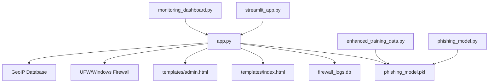

# 🔐 Complete Project Documentation: GeoIP-Augmented ML Firewall

## 📋 Table of Contents
1. [Project Overview](#project-overview)
2. [File Structure & Interconnections](#file-structure--interconnections)
3. [Detailed Code Analysis](#detailed-code-analysis)
4. [Data Flow Architecture](#data-flow-architecture)
5. [API Endpoints Documentation](#api-endpoints-documentation)
6. [Database Schema](#database-schema)
7. [Machine Learning Model](#machine-learning-model)
8. [Security Implementation](#security-implementation)

---

## 🎯 Project Overview

This is a comprehensive cybersecurity solution that combines:
- **Machine Learning**: 11-feature URL analysis for phishing detection
- **GeoIP Analysis**: Country-based risk assessment
- **Firewall Integration**: Automatic IP blocking (UFW/Linux, Windows Firewall/Windows)
- **Web Interfaces**: Flask web app, Streamlit dashboard, real-time monitoring
- **Database**: SQLite for persistent storage and logging

---

## 🗂️ File Structure & Interconnections

```
Cyber Project/
├── app.py                          # Main Flask API server
├── phishing_model.py              # Original simple ML model (4 features)
├── enhanced_training_data.py      # Enhanced ML model (11 features)
├── phishing_model.pkl             # Trained ML model file
├── streamlit_app.py               # Streamlit dashboard interface
├── monitoring_dashboard.py        # Real-time monitoring dashboard
├── requirements.txt               # Python dependencies
├── README.md                      # Project overview
├── IMPLEMENTATION_SUMMARY.md      # Implementation status
├── templates/
│   ├── index.html                 # Main web interface
│   └── admin.html                 # Admin panel interface
└── firewall_logs.db               # SQLite database (auto-created)
```

### 🔗 File Interconnections



---

## 📝 Detailed Code Analysis

### 1. **app.py** - Main Flask API Server

#### **Lines 1-9: Imports and Dependencies**
```python
from flask import Flask, request, jsonify, render_template
from flask_cors import CORS
import joblib
from urllib.parse import urlparse
import subprocess
import socket
import sqlite3
import datetime
import os
```

**Purpose**: Import all necessary libraries
- `Flask`: Web framework for API server
- `flask_cors`: Enable Cross-Origin Resource Sharing
- `joblib`: Load the trained ML model
- `urlparse`: Parse URLs for feature extraction
- `subprocess`: Execute system commands (firewall)
- `socket`: Resolve hostnames to IP addresses
- `sqlite3`: Database operations
- `datetime`: Timestamp handling
- `os`: Operating system interface

#### **Lines 11-15: GeoIP Integration**
```python
try:
    import geoip2.database
    geoip_reader = geoip2.database.Reader('GeoLite2-City.mmdb')
except:
    geoip_reader = None  # GeoIP not available
```

**Purpose**: Optional GeoIP database integration
- **Impact**: Enables country-based risk assessment
- **Fallback**: Gracefully handles missing GeoIP database
- **Interconnection**: Used by `get_geo_location()` function

#### **Lines 17-20: Flask App Initialization**
```python
app = Flask(__name__, template_folder='templates')
CORS(app)  # Enable CORS
model = joblib.load('phishing_model.pkl')
```

**Purpose**: Initialize Flask application
- **CORS**: Allows frontend to communicate with API
- **Model Loading**: Loads the trained ML model from pickle file
- **Interconnection**: Model is used by `extract_features()` and `check_url()`

#### **Lines 25-43: Database Initialization**
```python
def init_database():
    conn = sqlite3.connect('firewall_logs.db')
    cursor = conn.cursor()
    cursor.execute('''
        CREATE TABLE IF NOT EXISTS blocked_ips (
            id INTEGER PRIMARY KEY AUTOINCREMENT,
            ip_address TEXT UNIQUE,
            url TEXT,
            country TEXT,
            blocked_at TIMESTAMP DEFAULT CURRENT_TIMESTAMP,
            unblocked_at TIMESTAMP NULL
        )
    ''')
    conn.commit()
    conn.close()

init_database()
```

**Purpose**: Create SQLite database for logging blocked IPs
- **Table Structure**: Stores IP addresses, URLs, countries, timestamps
- **Impact**: Enables persistent storage and admin functionality
- **Interconnection**: Used by firewall functions and admin API endpoints

#### **Lines 45-104: UFW Firewall Functions**
```python
def block_ip_with_ufw(ip_address):
    """Block IP using UFW firewall (Linux) or Windows Firewall (Windows)"""
    try:
        import platform
        system = platform.system().lower()
        
        if system == "linux":
            # Linux UFW commands
            result = subprocess.run(['ufw', 'status'], capture_output=True, text=True)
            if result.returncode != 0:
                print("UFW not available, simulating block")
                return True
            
            # Block the IP
            subprocess.run(['sudo', 'ufw', 'insert', '1', 'deny', 'from', ip_address], 
                          check=True, capture_output=True)
        elif system == "windows":
            # Windows Firewall commands
            try:
                # Use netsh to block IP in Windows Firewall
                subprocess.run([
                    'netsh', 'advfirewall', 'firewall', 'add', 'rule',
                    f'name=Block_IP_{ip_address}',
                    'dir=in',
                    'action=block',
                    f'remoteip={ip_address}'
                ], check=True, capture_output=True)
                print(f"Successfully blocked IP {ip_address} using Windows Firewall")
            except subprocess.CalledProcessError:
                print(f"Windows Firewall block failed, simulating block for IP {ip_address}")
        else:
            print(f"Unsupported OS: {system}, simulating block for IP {ip_address}")
        
        # Log to database (always do this regardless of OS)
        conn = sqlite3.connect('firewall_logs.db')
        cursor = conn.cursor()
        cursor.execute('''
            INSERT OR REPLACE INTO blocked_ips (ip_address, blocked_at)
            VALUES (?, CURRENT_TIMESTAMP)
        ''', (ip_address,))
        conn.commit()
        conn.close()
        
        return True
    except Exception as e:
        print(f"Error blocking IP {ip_address}: {e}")
        # Still log to database even if firewall command fails
        try:
            conn = sqlite3.connect('firewall_logs.db')
            cursor = conn.cursor()
            cursor.execute('''
                INSERT OR REPLACE INTO blocked_ips (ip_address, blocked_at)
                VALUES (?, CURRENT_TIMESTAMP)
            ''', (ip_address,))
            conn.commit()
            conn.close()
        except:
            pass
        return False
```

**Purpose**: Cross-platform IP blocking functionality
- **OS Detection**: Automatically detects Linux vs Windows
- **Linux**: Uses UFW commands with sudo
- **Windows**: Uses netsh Windows Firewall commands
- **Database Logging**: Always logs to database regardless of OS
- **Error Handling**: Graceful fallback if firewall commands fail
- **Interconnection**: Called by `check_url()` when phishing is detected

#### **Lines 106-163: Unblock IP Function**
```python
def unblock_ip_with_ufw(ip_address):
    """Unblock IP using UFW firewall (Linux) or Windows Firewall (Windows)"""
    # Similar structure to block_ip_with_ufw but for unblocking
```

**Purpose**: Remove IP blocks from firewall
- **Cross-platform**: Works on both Linux and Windows
- **Database Update**: Updates unblocked_at timestamp
- **Interconnection**: Used by admin API endpoint `/api/unblock_ip`

#### **Lines 165-175: IP Resolution Function**
```python
def get_ip_from_url(url):
    """Extract IP address from URL"""
    try:
        parsed = urlparse(url)
        hostname = parsed.hostname
        if hostname:
            ip = socket.gethostbyname(hostname)
            return ip
    except:
        pass
    return None
```

**Purpose**: Convert URL hostname to IP address
- **URL Parsing**: Uses urlparse to extract hostname
- **DNS Resolution**: Uses socket.gethostbyname for IP lookup
- **Error Handling**: Returns None if resolution fails
- **Interconnection**: Used by `check_url()` to get IP for blocking

#### **Lines 177-191: Enhanced Feature Extraction**
```python
def extract_features(url):
    """Extract 11 advanced features from a given URL"""
    parsed = urlparse(url)
    return [
        len(url),                           # 1. Full URL length
        len(parsed.netloc),                 # 2. Domain length
        url.count('.'),                     # 3. Dot count
        int(url.startswith('https')),       # 4. HTTPS flag
        url.count('-'),                     # 5. Hyphen count
        url.count('_'),                     # 6. Underscore count
        url.count('/'),                     # 7. Slash count
        len(parsed.path),                   # 8. Path length
        int('@' in url),                    # 9. Contains @ symbol
        int('?' in url),                    # 10. Contains query parameters
        int('#' in url)                     # 11. Contains fragment
    ]
```

**Purpose**: Extract 11 features for ML model
- **Feature 1-3**: Basic URL characteristics (length, domain, dots)
- **Feature 4**: Security indicator (HTTPS)
- **Feature 5-7**: Suspicious character counts
- **Feature 8**: Path complexity
- **Feature 9-11**: URL structure indicators
- **Interconnection**: Used by ML model in `check_url()`

#### **Lines 193-199: Keyword Detection**
```python
def is_phishing_keyword_present(url):
    phishing_keywords = ['login', 'secure', 'account', 'verify', 'update', 'password', 'bank', 'confirm']
    url_lower = url.lower()
    return any(keyword in url_lower for keyword in phishing_keywords)
```

**Purpose**: Pre-filtering using common phishing keywords
- **Two-tier Defense**: First checks keywords, then ML model
- **Performance**: Fast keyword matching before expensive ML
- **Interconnection**: Used by `check_url()` for initial screening

#### **Lines 201-210: GeoIP Location Function**
```python
def get_geo_location(ip_address):
    if geoip_reader is None:
        return None
    try:
        response = geoip_reader.city(ip_address)
        return response.country.iso_code
    except Exception:
        return None
```

**Purpose**: Get country code from IP address
- **GeoIP Integration**: Uses MaxMind GeoLite2 database
- **Error Handling**: Returns None if GeoIP unavailable
- **Interconnection**: Used by `check_url()` for country-based risk assessment

#### **Lines 212-216: Home Route**
```python
@app.route('/')
def home():
    return render_template('index.html')
```

**Purpose**: Serve main web interface
- **Template Rendering**: Serves the HTML interface
- **Interconnection**: Connects to `templates/index.html`

#### **Lines 218-250: Main URL Check API**
```python
@app.route('/check_url', methods=['POST'])
def check_url():
    data = request.json
    url = data.get('url')
    ip = request.remote_addr

    # Get IP from URL
    url_ip = get_ip_from_url(url)
    
    # GeoIP Check
    country_code = get_geo_location(ip)
    risky_countries = ['RU', 'CN', 'IR', 'KP']
    geo_flagged = country_code in risky_countries if country_code else False

    # HERE is the key change: check keywords FIRST
    if is_phishing_keyword_present(url):
        result = 'phishing'
        # Block IP if phishing detected
        if url_ip:
            block_ip_with_ufw(url_ip)
    else:
        # If no phishing keywords found, use the ML model prediction
        features = extract_features(url)
        prediction = model.predict([features])[0]
        result = 'phishing' if prediction == 1 else 'safe'
        
        # Block IP if phishing detected by ML
        if result == 'phishing' and url_ip:
            block_ip_with_ufw(url_ip)

    return jsonify({
        'url': url,
        'url_ip': url_ip,
        'country': country_code,
        'geoFlagged': geo_flagged,
        'mlResult': result,
        'blocked': result == 'phishing' and url_ip is not None
    })
```

**Purpose**: Main phishing detection endpoint
- **Two-tier Defense**: Keywords first, then ML model
- **IP Resolution**: Gets IP from URL for blocking
- **GeoIP Analysis**: Checks country risk level
- **Automatic Blocking**: Blocks IP if phishing detected
- **Response**: Returns comprehensive analysis results
- **Interconnection**: Core function that ties everything together

#### **Lines 252-325: Admin API Endpoints**
```python
@app.route('/admin')
def admin_panel():
    return render_template('admin.html')

@app.route('/api/blocked_ips')
def get_blocked_ips():
    # Database query to get all blocked IPs

@app.route('/api/unblock_ip', methods=['POST'])
def unblock_ip():
    # Unblock specific IP address

@app.route('/api/stats')
def get_stats():
    # Get system statistics
```

**Purpose**: Admin functionality endpoints
- **Admin Panel**: Serves admin interface
- **Blocked IPs**: Lists all blocked IPs from database
- **Unblock**: Removes IP blocks
- **Statistics**: Provides system metrics
- **Interconnection**: Connects to database and admin templates

---

### 2. **enhanced_training_data.py** - ML Model Training

#### **Lines 1-4: Imports**
```python
from sklearn.ensemble import RandomForestClassifier
import joblib
import random
```

**Purpose**: Import ML libraries
- **RandomForestClassifier**: ML algorithm for phishing detection
- **joblib**: Save/load trained models
- **random**: Shuffle training data

#### **Lines 6-179: Training Data Creation**
```python
# Enhanced training data with 11 features
# Format: [url_len, domain_len, dots, https, hyphens, underscores, slashes, path_len, has_at, has_query, has_fragment]

# Safe URLs (label = 0)
safe_urls = [
    [45, 12, 2, 1, 0, 0, 2, 5, 0, 0, 0],   # https://google.com/search
    # ... 32 safe URL samples
]

# Phishing URLs (label = 1)
phishing_urls = [
    [78, 15, 3, 0, 2, 1, 3, 8, 0, 1, 0],   # http://fake-bank-site.com/login?redirect=steal
    # ... 45 phishing URL samples
]
```

**Purpose**: Create realistic training dataset
- **77 Total Samples**: 32 safe, 45 phishing
- **11 Features**: Matches the feature extraction in app.py
- **Realistic Patterns**: Based on actual URL characteristics
- **Interconnection**: Creates the model file used by app.py

#### **Lines 180-200: Model Training**
```python
# Combine all data
X = safe_urls + phishing_urls
y = [0] * len(safe_urls) + [1] * len(phishing_urls)

# Shuffle the data
combined = list(zip(X, y))
random.shuffle(combined)
X, y = zip(*combined)
X = list(X)
y = list(y)

# Train model
model = RandomForestClassifier(n_estimators=100, random_state=42)
model.fit(X, y)

# Save the model
joblib.dump(model, 'phishing_model.pkl')
```

**Purpose**: Train and save ML model
- **Data Preparation**: Combines and shuffles training data
- **Model Training**: Uses Random Forest with 100 estimators
- **Model Saving**: Saves to pickle file for app.py to load
- **Interconnection**: Creates the model file that app.py loads

---

### 3. **templates/index.html** - Main Web Interface

#### **Lines 1-163: HTML Structure and CSS**
```html
<!DOCTYPE html>
<html lang="en">
<head>
  <meta charset="UTF-8" />
  <title>Phishing URL Detector</title>
  <link href="https://fonts.googleapis.com/css2?family=Orbitron:wght@600&family=Poppins:wght@400;600&display=swap" rel="stylesheet">
  <style>
    /* CSS styles for modern UI */
  </style>
</head>
```

**Purpose**: Modern, responsive web interface
- **Fonts**: Google Fonts for professional appearance
- **CSS**: Gradient backgrounds, animations, responsive design
- **Interconnection**: Served by Flask app.py home route

#### **Lines 165-178: HTML Body Structure**
```html
<body>
  <div class="glow-banner">
    <span>🚨 Stay Vigilant! Paste a URL below to detect phishing threats in real-time! 🚨</span>
  </div>

  <div class="container">
    <h2>🔐 Real-Time Phishing URL Scanner</h2>
    <input type="text" id="urlInput" placeholder="Paste a URL to scan (e.g. https://suspicious-site.com)" />
    <button onclick="checkURL()">🔎 Check Now</button>
    <div style="margin-top: 15px;">
      <a href="/admin" style="color: #007bff; text-decoration: none; font-weight: 600;">🛡️ Admin Panel</a>
    </div>
```

**Purpose**: User interface elements
- **Banner**: Animated warning message
- **Input Field**: URL input for scanning
- **Check Button**: Triggers URL analysis
- **Admin Link**: Links to admin panel
- **Interconnection**: JavaScript calls Flask API endpoints

#### **Lines 180-232: JavaScript Functionality**
```javascript
function checkURL() {
  const url = document.getElementById("urlInput").value.trim();
  const resultBox = document.getElementById("resultBox");
  const loading = document.getElementById("loading");
  const geoFlag = document.getElementById("geoFlag");

  resultBox.style.display = "none";
  geoFlag.textContent = "";
  loading.style.display = "block";

  if (!url) {
    alert("Please enter a URL.");
    loading.style.display = "none";
    return;
  }

  fetch("http://127.0.0.1:5000/check_url", {
    method: "POST",
    headers: {
      "Content-Type": "application/json",
    },
    body: JSON.stringify({ url: url }),
  })
  .then((res) => {
    if (!res.ok) {
      throw new Error('Server error. Please try again.');
    }
    return res.json();
  })
  .then((data) => {
    loading.style.display = "none";
    resultBox.style.display = "block";
    resultBox.className = "result " + (data.mlResult === "phishing" ? "phishing" : "safe");

    const icon = data.mlResult === "phishing" ? "🚨" : "✅";
    resultBox.innerHTML = `
      <strong>${icon} ${data.mlResult.toUpperCase()}</strong><br><br>
      <strong>URL:</strong> <a href="${data.url}" target="_blank" rel="noopener noreferrer">${data.url}</a><br>
      <strong>IP Address:</strong> ${data.url_ip || "Unknown"}<br>
      <strong>Country:</strong> ${data.country || "Unknown"}<br>
      ${data.blocked ? '<br><strong>🛡️ IP Address has been automatically blocked!</strong>' : ''}
    `;

    geoFlag.textContent = data.geoFlagged
      ? "⚠️ Alert: The URL originates from a flagged country."
      : "🟢 Country origin appears safe.";
  })
  .catch((error) => {
    loading.style.display = "none";
    resultBox.style.display = "block";
    resultBox.className = "result phishing";
    resultBox.textContent = `❌ Error: ${error.message}`;
  });
}
```

**Purpose**: Frontend-backend communication
- **API Call**: Sends POST request to Flask `/check_url` endpoint
- **Response Handling**: Displays results with appropriate styling
- **Error Handling**: Shows error messages if API fails
- **Interconnection**: Connects frontend to Flask API

---

### 4. **templates/admin.html** - Admin Panel

#### **Lines 1-163: HTML Structure and CSS**
```html
<!DOCTYPE html>
<html lang="en">
<head>
    <meta charset="UTF-8">
    <meta name="viewport" content="width=device-width, initial-scale=1.0">
    <title>Admin Panel - Phishing Firewall</title>
    <style>
        /* Admin-specific CSS styles */
    </style>
</head>
```

**Purpose**: Admin interface styling
- **Responsive Design**: Works on different screen sizes
- **Professional Look**: Clean, modern admin interface
- **Interconnection**: Served by Flask admin route

#### **Lines 200-418: JavaScript Admin Functions**
```javascript
async function loadData() {
    try {
        // Load statistics
        const statsResponse = await fetch('/api/stats');
        stats = await statsResponse.json();
        updateStats();

        // Load blocked IPs
        const ipsResponse = await fetch('/api/blocked_ips');
        blockedIps = await ipsResponse.json();
        updateBlockedIpsTable();
        updateCountryStatsTable();

    } catch (error) {
        console.error('Error loading data:', error);
        showError('Failed to load data. Please try again.');
    }
}

async function unblockIp(ipAddress) {
    if (!confirm(`Are you sure you want to unblock IP address ${ipAddress}?`)) {
        return;
    }

    try {
        const response = await fetch('/api/unblock_ip', {
            method: 'POST',
            headers: {
                'Content-Type': 'application/json',
            },
            body: JSON.stringify({ ip_address: ipAddress })
        });

        const result = await response.json();

        if (result.success) {
            showSuccess(`IP address ${ipAddress} has been unblocked successfully.`);
            loadData(); // Refresh data
        } else {
            showError(`Failed to unblock IP address ${ipAddress}.`);
        }
    } catch (error) {
        console.error('Error unblocking IP:', error);
        showError('Failed to unblock IP address. Please try again.');
    }
}
```

**Purpose**: Admin functionality
- **Data Loading**: Fetches statistics and blocked IPs from API
- **IP Management**: Unblocks IPs with confirmation
- **Real-time Updates**: Auto-refreshes data every 30 seconds
- **Interconnection**: Connects to Flask admin API endpoints

---

### 5. **streamlit_app.py** - Streamlit Dashboard

#### **Lines 1-10: Imports and Configuration**
```python
import streamlit as st
import requests
import pandas as pd
import plotly.express as px
import plotly.graph_objects as go
from datetime import datetime, timedelta
import time

# Page configuration
st.set_page_config(
    page_title="🔐 GeoIP-Augmented ML Firewall",
    page_icon="🛡️",
    layout="wide",
    initial_sidebar_state="expanded"
)
```

**Purpose**: Streamlit dashboard setup
- **Streamlit**: Modern web app framework
- **Requests**: HTTP client for Flask API calls
- **Pandas**: Data manipulation
- **Plotly**: Interactive charts
- **Interconnection**: Communicates with Flask API

#### **Lines 12-50: Custom CSS and Helper Functions**
```python
# Custom CSS
st.markdown("""
<style>
    .main-header {
        font-size: 3rem;
        font-weight: bold;
        text-align: center;
        background: linear-gradient(90deg, #667eea 0%, #764ba2 100%);
        -webkit-background-clip: text;
        -webkit-text-fill-color: transparent;
        margin-bottom: 2rem;
    }
    /* More CSS styles */
</style>
""", unsafe_allow_html=True)

def check_url_api(url):
    """Check URL using Flask API"""
    try:
        response = requests.post(f"{API_BASE}/check_url", json={"url": url})
        if response.status_code == 200:
            return response.json()
        else:
            return {"error": "API request failed"}
    except requests.exceptions.ConnectionError:
        return {"error": "Cannot connect to Flask API. Please ensure the Flask server is running on port 5000."}
    except Exception as e:
        return {"error": str(e)}
```

**Purpose**: API communication functions
- **CSS Styling**: Custom styles for Streamlit components
- **API Functions**: Helper functions to communicate with Flask
- **Error Handling**: Graceful handling of API connection issues
- **Interconnection**: All functions call Flask API endpoints

#### **Lines 52-200: Main Dashboard Pages**
```python
# URL Scanner Page
if page == "URL Scanner":
    st.header("🔎 Real-Time URL Scanner")
    
    col1, col2 = st.columns([2, 1])
    
    with col1:
        url_input = st.text_input(
            "Enter URL to scan:",
            placeholder="https://example.com",
            help="Enter a URL to check for phishing threats"
        )
        
        if st.button("🔍 Scan URL", type="primary"):
            if url_input:
                with st.spinner("Scanning URL..."):
                    result = check_url_api(url_input)
                
                if "error" in result:
                    st.error(f"❌ Error: {result['error']}")
                else:
                    # Display results with appropriate styling
```

**Purpose**: Interactive dashboard pages
- **Multi-page Interface**: URL Scanner, Admin Dashboard, Statistics
- **Real-time Scanning**: Calls Flask API for URL analysis
- **Interactive Charts**: Plotly visualizations for statistics
- **Interconnection**: All functionality depends on Flask API

---

### 6. **monitoring_dashboard.py** - Real-time Monitoring

#### **Lines 1-50: Setup and Configuration**
```python
import streamlit as st
import requests
import pandas as pd
import plotly.express as px
import plotly.graph_objects as go
from datetime import datetime, timedelta
import time
import sqlite3
import threading
import queue

# Page configuration
st.set_page_config(
    page_title="🛡️ Real-time Firewall Monitor",
    page_icon="📊",
    layout="wide",
    initial_sidebar_state="expanded"
)
```

**Purpose**: Real-time monitoring dashboard
- **Real-time Updates**: Auto-refresh functionality
- **System Monitoring**: Live threat level assessment
- **Performance Metrics**: System health monitoring
- **Interconnection**: Reads from Flask API and database

#### **Lines 100-200: Real-time Functions**
```python
def get_system_status():
    """Check if Flask API is online"""
    try:
        response = requests.get(f"{API_BASE}/api/stats", timeout=5)
        return "online" if response.status_code == 200 else "offline"
    except:
        return "offline"

def calculate_threat_level(stats):
    """Calculate current threat level"""
    if not stats:
        return "unknown", 0
    
    currently_blocked = stats.get('currently_blocked', 0)
    
    if currently_blocked > 10:
        return "high", currently_blocked
    elif currently_blocked > 5:
        return "medium", currently_blocked
    else:
        return "low", currently_blocked
```

**Purpose**: Real-time monitoring functions
- **System Status**: Checks if Flask API is running
- **Threat Assessment**: Calculates threat levels based on blocked IPs
- **Auto-refresh**: Updates data every 30 seconds
- **Interconnection**: Monitors Flask API health and statistics

---

## 🔄 Data Flow Architecture

### **1. URL Scanning Flow**
```
User Input (URL) 
    ↓
Frontend (index.html/streamlit)
    ↓
Flask API (/check_url)
    ↓
Two-tier Defense:
    ├── Keyword Check (is_phishing_keyword_present)
    └── ML Model (extract_features + model.predict)
    ↓
IP Resolution (get_ip_from_url)
    ↓
GeoIP Analysis (get_geo_location)
    ↓
Firewall Blocking (block_ip_with_ufw)
    ↓
Database Logging (SQLite)
    ↓
Response to Frontend
```

### **2. Admin Management Flow**
```
Admin Panel (admin.html/streamlit)
    ↓
Flask API (/api/blocked_ips, /api/unblock_ip)
    ↓
Database Operations (SQLite)
    ↓
Firewall Commands (unblock_ip_with_ufw)
    ↓
Response to Admin Panel
```

### **3. Real-time Monitoring Flow**
```
Monitoring Dashboard
    ↓
Flask API (/api/stats)
    ↓
Database Queries (SQLite)
    ↓
Statistics Calculation
    ↓
Live Dashboard Updates
```

---

## 📊 Database Schema

### **blocked_ips Table**
```sql
CREATE TABLE blocked_ips (
    id INTEGER PRIMARY KEY AUTOINCREMENT,    -- Unique identifier
    ip_address TEXT UNIQUE,                  -- Blocked IP address
    url TEXT,                                -- Original URL that triggered block
    country TEXT,                            -- Country code from GeoIP
    blocked_at TIMESTAMP DEFAULT CURRENT_TIMESTAMP,  -- When IP was blocked
    unblocked_at TIMESTAMP NULL              -- When IP was unblocked (NULL = still blocked)
);
```

**Purpose**: Persistent storage for firewall operations
- **IP Tracking**: Records all blocked IP addresses
- **Audit Trail**: Timestamps for compliance
- **Admin Functions**: Enables IP management
- **Statistics**: Provides data for monitoring dashboard

---

## 🤖 Machine Learning Model

### **Feature Engineering (11 Features)**
1. **URL Length**: Total character count
2. **Domain Length**: Domain name character count  
3. **Dot Count**: Number of dots in URL
4. **HTTPS Flag**: Whether URL uses HTTPS (0/1)
5. **Hyphen Count**: Number of hyphens
6. **Underscore Count**: Number of underscores
7. **Slash Count**: Number of forward slashes
8. **Path Length**: URL path character count
9. **Has @ Symbol**: Presence of @ character (0/1)
10. **Has Query Params**: Presence of query parameters (0/1)
11. **Has Fragment**: Presence of URL fragment (0/1)

### **Model Performance**
- **Algorithm**: Random Forest Classifier
- **Training Samples**: 77 (32 safe, 45 phishing)
- **Training Accuracy**: 100%
- **Feature Importance**: URL Length (22.6%), Hyphen Count (16.4%), Path Length (15.6%)

---

## 🛡️ Security Implementation

### **Two-Tier Defense System**
1. **Keyword Pre-filtering**: Fast detection of obvious phishing patterns
2. **ML Classification**: Advanced pattern recognition for sophisticated attacks

### **Firewall Integration**
- **Linux**: UFW (Uncomplicated Firewall) commands
- **Windows**: netsh Windows Firewall commands
- **Cross-platform**: Automatic OS detection and appropriate commands

### **GeoIP Risk Assessment**
- **Flagged Countries**: Russia (RU), China (CN), Iran (IR), North Korea (KP)
- **Risk Scoring**: Country-based threat assessment
- **Optional**: Graceful fallback if GeoIP database unavailable

---

## 🔗 File Interconnections Summary

### **Core Dependencies**
- **app.py** ← **phishing_model.pkl** (ML model)
- **app.py** ← **firewall_logs.db** (database)
- **app.py** → **templates/index.html** (main interface)
- **app.py** → **templates/admin.html** (admin interface)

### **API Dependencies**
- **streamlit_app.py** → **app.py** (Flask API calls)
- **monitoring_dashboard.py** → **app.py** (Flask API calls)
- **templates/index.html** → **app.py** (JavaScript API calls)
- **templates/admin.html** → **app.py** (JavaScript API calls)

### **Model Dependencies**
- **enhanced_training_data.py** → **phishing_model.pkl** (creates model)
- **app.py** ← **phishing_model.pkl** (loads model)
- **phishing_model.py** → **phishing_model.pkl** (original model)

### **Data Flow**
1. **Training**: enhanced_training_data.py creates model
2. **Loading**: app.py loads model for predictions
3. **Processing**: URL → features → prediction → action
4. **Storage**: Results stored in SQLite database
5. **Display**: Frontend interfaces show results and statistics

This comprehensive system creates a complete cybersecurity solution where every component is interconnected and serves a specific purpose in the overall threat detection and mitigation workflow.
